# libx11-compat

`libx11-compat` is an in-process implementation of the [X Window System](https://en.wikipedia.org/wiki/X_Window_System) client library (Xlib) layered on top of [SDL](https://www.libsdl.org/) (SDL2 or SDL3), SDL_ttf, and pixman.
It lets existing Xlib clients keep their source unchanged while running on platforms where a conventional X server is unavailable or inconvenient:
macOS without XQuartz, Wayland-only sessions, headless CI, Android apps with their own SDL integration, and similar environments.

Both SDL major versions are supported from a single source tree: the build
auto-detects SDL3 (when both SDL3 and SDL3_ttf are visible to `pkg-config`) and
otherwise uses SDL2, and the backend can be selected explicitly. See
[SDL backend](#sdl-backend) below.

The library is not a re-implementation of the X11 wire protocol and does not replace a real X server.
Its goal is to keep legacy Xlib code building and running while it is being migrated to a different toolkit or display stack.

## Building

The build is Makefile-based and organized as small `mk/` fragments.
The required dependencies are pixman plus one SDL stack: either SDL2 + SDL2_ttf
or SDL3 + SDL3_ttf (see [SDL backend](#sdl-backend)).
Optional validation workloads may need their upstream build tools; Osiris uses
Meson and Ninja at build time and links against libjpeg, libpng, and freetype.

```sh
make
make check
```

### SDL backend

The same source builds against either SDL major version, selected by the
`SDL_BACKEND` make variable:

```sh
make                      # auto-detect: SDL3 if present, otherwise SDL2
make SDL_BACKEND=sdl2     # force the SDL2 backend
make SDL_BACKEND=sdl3     # force the native SDL3 backend
```

When `SDL_BACKEND` is unset, the build prefers SDL3 when both `sdl3` and
`sdl3-ttf` are visible to `pkg-config`, and falls back to SDL2 otherwise; an
explicit `SDL_BACKEND=...` always wins.

Under the SDL2 backend the compat stack links small in-tree wrapper shims
(`libSDL2-x11compat.so`, `libSDL2_ttf-x11compat.so`) that `dlopen` the host SDL2
at runtime, so a system SDL2 that is itself
[sdl2-compat](https://github.com/libsdl-org/sdl2-compat) over SDL3 also works.
Under the SDL3 backend the stack links `libSDL3` and `libSDL3_ttf` directly; a
single chokepoint header (`src/sdl-compat.h`) translates the SDL2-spelled API
the sources are written against to SDL3, so no source changes are needed to
switch backends.

`make check` runs the in-tree C tests, exported-symbol coverage, Motif link and demo checks, replay-driven UI smoke tests, and system-X11 differential checks.
For faster local loops, use `make check-unit`, `make check-smoke`, or `make check-differential` depending on the subsystem being changed.
See [`docs/UI-REPLAY.md`](docs/UI-REPLAY.md) for the replay grammar, the runner CLI, and the state / image / timeline assertion schemas behind the UI smoke tests.

Verbose diagnostics for unimplemented or fall-back paths are gated behind a build flag:

```sh
make CFLAGS_EXTRA=-DDEBUG_LIBX11_COMPAT
```

The output artifact is `build/libX11-compat.so`.
Clients link against it the same way they would link against the system `libX11.so`.

## Examples

`examples/` bundles real Xlib clients built against the local `libX11-compat.so`:

```sh
make examples
build/examples/2048
```

The bundle covers a 2048 game, a paint demo, Conway's Game of Life, an analog clock, an interactive Mandelbrot viewer, a single-runner Processing-style showcase, an SDL-backed clipboard `TARGETS` probe, and the upstream X.Org `x11perf` benchmark.
See [`docs/EXAMPLES.md`](docs/EXAMPLES.md) for the API each example exercises.
The screenshot above is from the larger ViolaWWW port described in [Larger Workloads Under Investigation](#larger-workloads-under-investigation).

## Larger Workloads Under Investigation

Several ports beyond the bundled demos now provide high-value integration coverage for `libx11-compat`.
They are still compatibility workloads rather than daily-use application ports,
but each exercises behavior that small examples do not reach.

- [Motif](https://en.wikipedia.org/wiki/Motif_(software)): upstream Motif and its demo suite build against the compatibility libraries.
  Menu posting, pointer grabs, focus changes, text rendering, resource lookups, and selected demo workflows all work.
  Some widget paths still expose layout artifacts or map/expose propagation gaps that require further work.

  Motif's GLw OpenGL-widget path runs too: the classic `paperplane` demo drives a `GLwDrawingArea` through the in-tree GLX-over-EGL layer, so live Motif menus and an animated 3D scene render together with no X server and no desktop-GL driver (desktop GL 1.x/2.x is translated by the bundled [gl4es](https://github.com/ptitSeb/gl4es) to [ANGLE](https://github.com/google/angle)'s GLES on Metal, with surfaceless Mesa as the Linux provider). See [GLX and OpenGL](#glx-and-opengl) for the capability and its limits.

  <a href="assets/paperplane.png">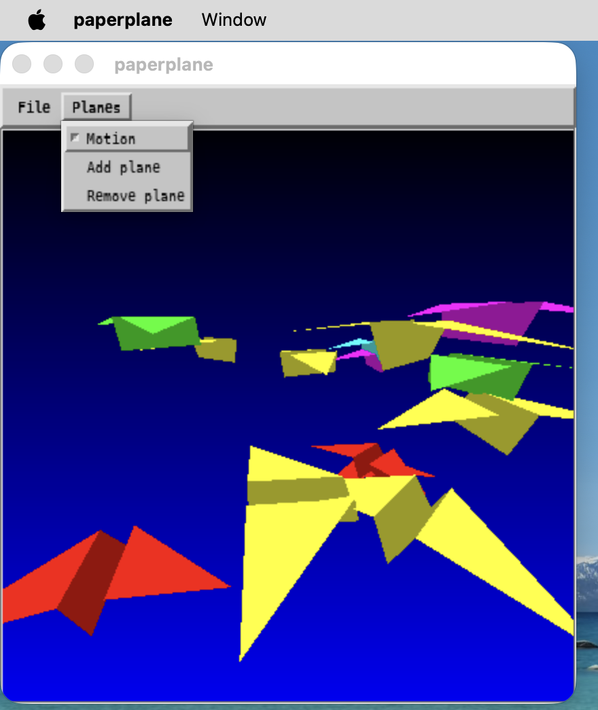</a>
- [ViolaWWW](https://en.wikipedia.org/wiki/ViolaWWW): the 1992-era Motif web browser builds and runs out of the consolidated `build/` tree,
  loads HTTP pages over the network,
  renders inline XPM images through `libXpm-compat`,
  and handles scrolling, resize redraw, and the Help menu.
  Recent fixes corrected stale glyphs after wheel scrolling, scrollbar dragging, and resize reflow.
  HTTPS, complex modern HTML, and several interactive flows are known limitations of the application itself rather than the compatibility layer.

  <a href="assets/violawww.png">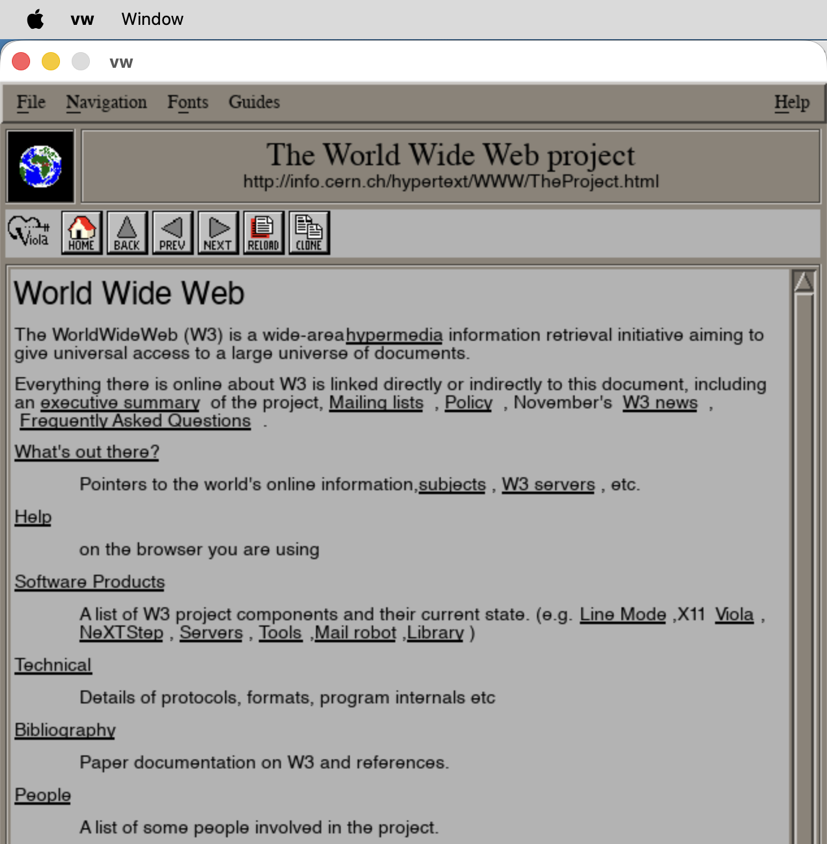</a>

  ```sh
  make violawww                          # build ViolaWWW (depends on motif)
  build/violawww/source/src/vw/vw        # launch the browser
  ```

- [NCSA Mosaic](https://en.wikipedia.org/wiki/Mosaic_(web_browser)): the maintained [thentenaar/mosaic-ng](https://github.com/thentenaar/mosaic-ng) fork of the seminal 1993 graphical browser builds against the compat stack plus the bundled Motif.
  It loads HTTP pages, lays out inline images and tables, and handles initial paint, scrolling, hyperlink navigation, and URL-field editing.
  HTTPS and modern HTML/CSS remain application-level limitations.

  <a href="assets/mosaic.png">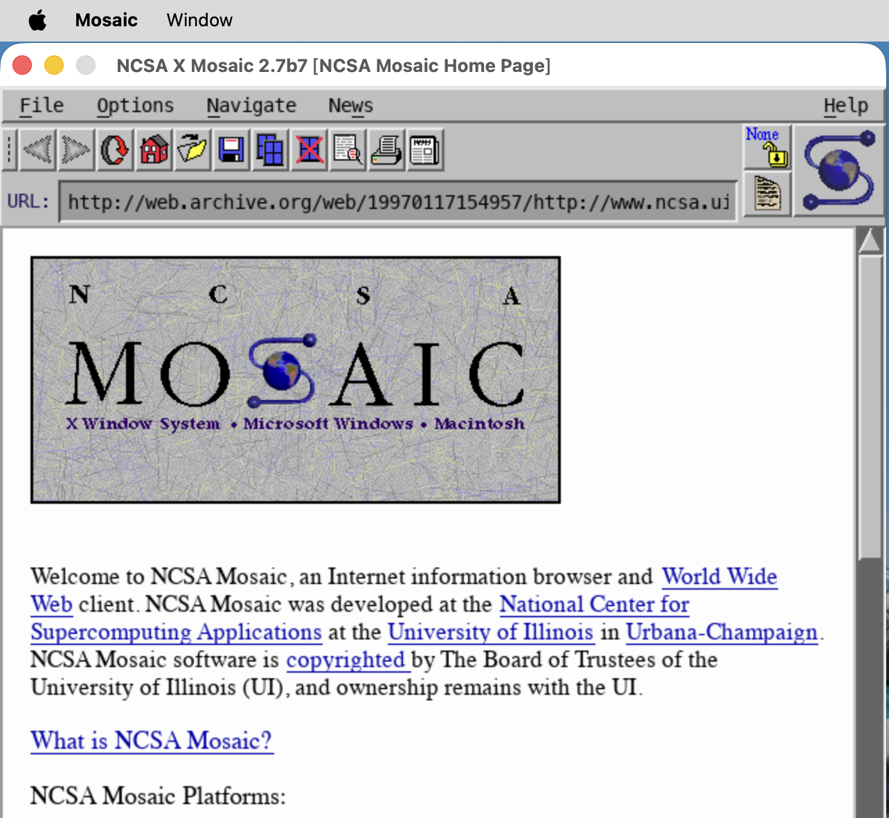</a>

  ```sh
  make mosaic                            # build Mosaic (depends on motif)
  build/mosaic/source/src/Mosaic         # launch the browser
  ```

- [Osiris](https://centre.libranext.com/libranext/osiris): a maintained Qt 2.3.2 fork builds against `libX11-compat`, `libXext-compat`, `libXmu-compat`, and the link-only `libICE-compat` / `libSM-compat` shims.
  This is the Qt2 validation target and exercises widget stacking, popup/menu placement, font metrics, timer delivery, expose handling, event-loop responsiveness, and Qt Designer behavior.
  The in-tree build disables Osiris Xft, OpenGL, SM, MNG, and GIF feature probes so the default dependency boundary stays SDL2, SDL2_ttf, and pixman.
  Building this workload requires Meson, Ninja, libjpeg, libpng, and freetype; override the Meson and Ninja paths with `OSIRIS_MESON=/path/to/meson` and `OSIRIS_NINJA=/path/to/ninja` if needed.

  <a href="assets/osiris.png">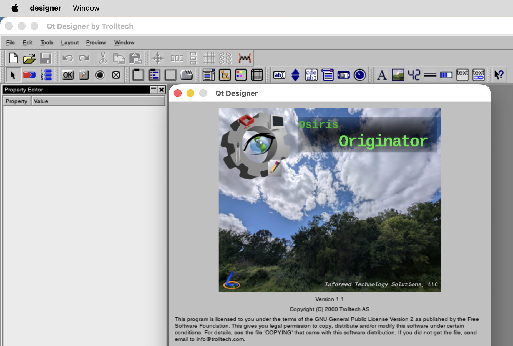</a>

  ```sh
  make osiris                            # fetch, patch, configure, and build Osiris
  build/osiris/build/designer            # launch Qt Designer
  make check-demos-osiris                # launch built tutorials/examples long enough to catch crashes
  ```

- [Xfig](https://mcj.sourceforge.net/): the classic Athena-based vector drawing program builds against the compat stack and the bundled libXaw.
  It exercises the full Xt + Athena widget stack (menus, scrollbars, text widgets), large-canvas polyline and ellipse redraw, `XDrawString` font metrics, GXxor rubber-band feedback during mouse drags, and ICCCM text-property round-tripping in the File Open dialog.
  Sample drawings live in [`tests/data/`](tests/data/) and cover a small flowchart, a voltage-divider circuit, a mind map, and an 8x6 rendering stress grid.

  <a href="assets/xfig.png">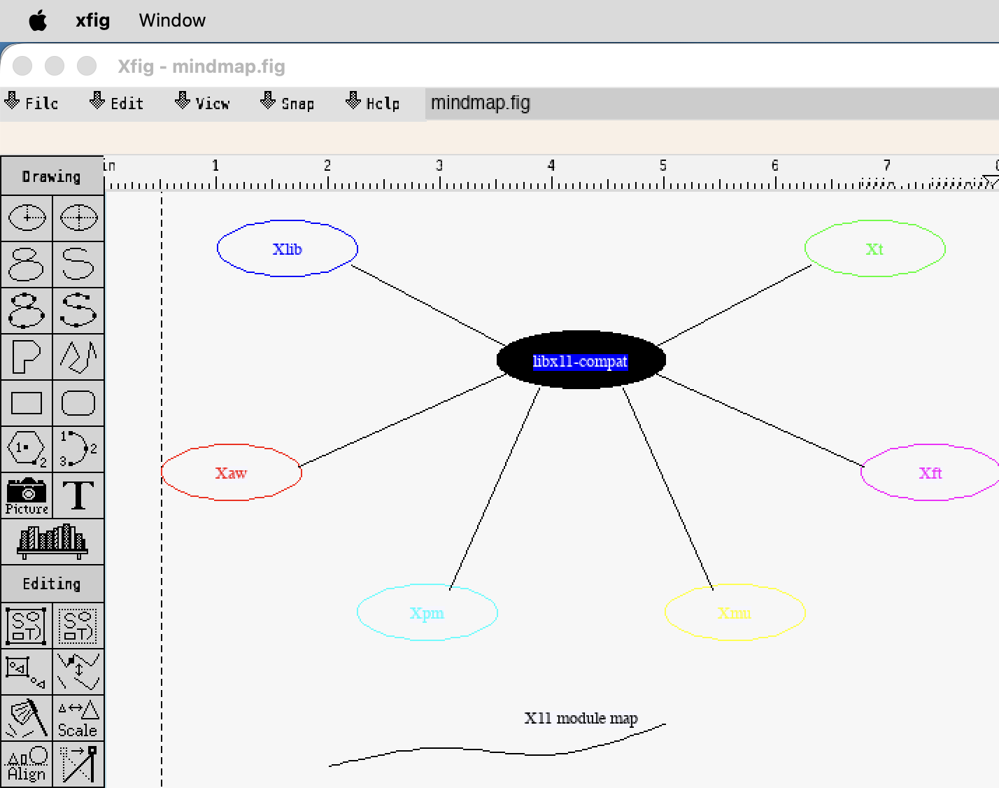</a>

  ```sh
  make xfig                              # build Xfig (depends on libXaw)
  build/xfig/source/src/xfig tests/data/mindmap.fig
  ```

- [XCircuit](http://opencircuitdesign.com/xcircuit/): the PostScript-oriented schematic capture and drawing editor builds against the compat stack plus the bundled libXt, libXpm, and the libICE / libSM session libraries.
  It drives the Xt Intrinsics widget tree and XCircuit's own Xlib-drawn canvas, Xpm-backed toolbar and object icons, `XDrawString` font metrics across the Symbol and Helvetica families, `XCopyArea` backing-pixmap redraw for the file-list hover highlight, object-instance drawing with fixed and normal bounding boxes, and larger PostScript example imports opened through its menus and file dialogs.

  <a href="assets/xcircuit.png">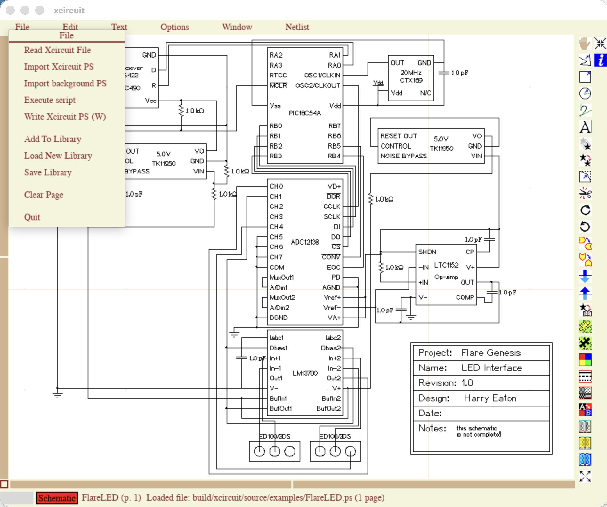</a>

  ```sh
  make xcircuit                          # build XCircuit
  build/xcircuit/source/xcircuit         # launch
  ```

- [GIMP 0.54](https://en.wikipedia.org/wiki/GIMP): the 1996 release, the last GIMP built on the Motif toolkit before the project moved to GTK, builds against the compat stack plus the bundled Motif.
  It is a full image editor that drives `XCreateImage` / `XPutImage` / `XGetImage`, the MIT-SHM canvas path (`src/xshm.c`), TrueColor 32bpp visual and colormap handling, large Motif dialog and menu trees, and forked image-format plug-ins (PNG / JPEG) that talk to the core over pipes and SysV shared-memory tiles.
  The patch set under `compat/gimp-patches/` is the GNOME-hosted balooii rework that fixes the 1996 source for a modern LP64 toolchain.

  <a href="assets/gimp.png">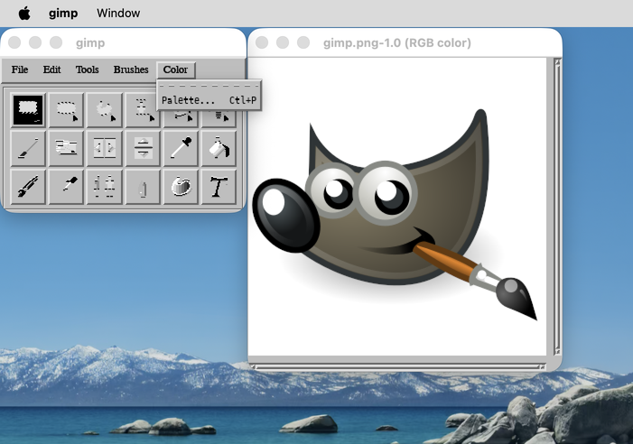</a>

  ```sh
  make gimp-motif                        # build GIMP 0.54.1 (depends on motif)
  build/gimp-motif/source/app/gimp       # launch the editor
  ```

- [CinePaint](https://en.wikipedia.org/wiki/CinePaint): the deep-paint, high-bit-depth image editor descended from Film Gimp (itself a fork of GIMP) is the toolkit's first GTK+ 1.2 workload.
  GTK1 is ported alongside it: the [robinrowe/gtk1](https://gitlab.com/robinrowe/gtk1) fork builds against the compat stack with two small patches under `compat/gtk1-patches/` (a CMake libx11-compat probe and an X11 font-list implementation) and is exercised on its own by a `gtk1-hello` application.
  CinePaint then drives the full GTK1 stack through `libX11-compat`: the splash and startup widget tree, the About dialog, the main image window and drawing canvas, palette PNG load and render, the forked PNG plug-in path, and first-run `cinepaintrc` creation.

  <a href="assets/cinepaint.png">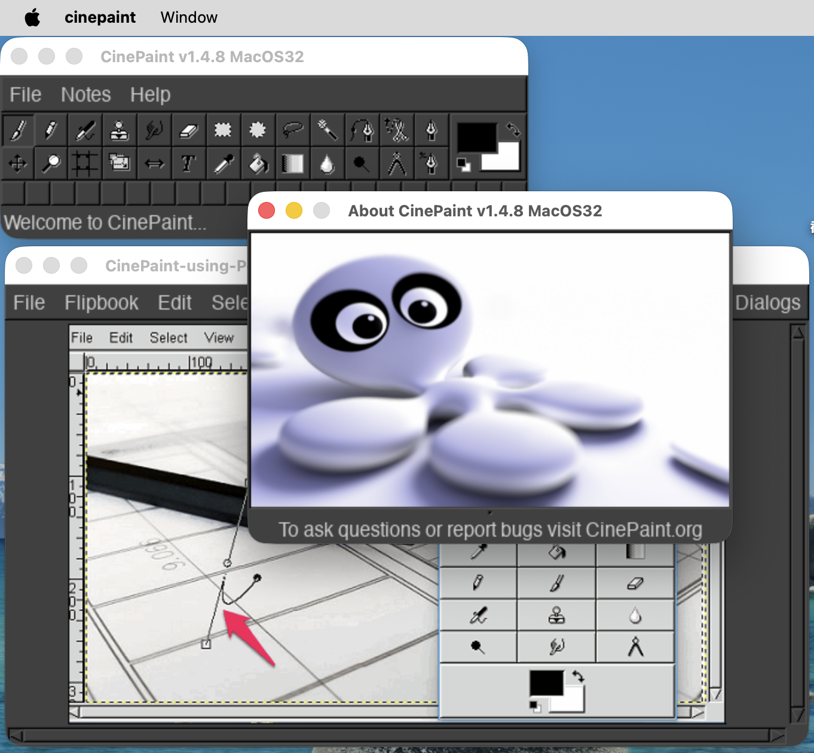</a>

  ```sh
  make cinepaint                         # build GTK1 + CinePaint against libx11-compat
  build/cinepaint/cmake/cinepaint        # launch the editor
  ```

- [XMMS](https://en.wikipedia.org/wiki/XMMS): the 1.2.x audio player, a GTK1 Winamp-style workload, builds against the compat stack alongside the ported GTK1 fork, driven on macOS by a small in-tree CoreAudio output plugin (`compat/xmms-coreaudio/`).
  It exercises the SHAPE extension that skinned players rely on: the main window, equalizer, and playlist are non-rectangular, so bounding-mask hit-testing routes pointer and focus events only on the visible pixels and lets clicks fall through transparent corners.
  Skin pixmap loading, window dragging, the menu and equalizer/playlist toggles, `WM_DELETE_WINDOW` shutdown, and audio playback through the CoreAudio plugin all work; the main-window, equalizer, playlist, and menu states are covered by the replay smoke tests.

  <a href="assets/xmms.png">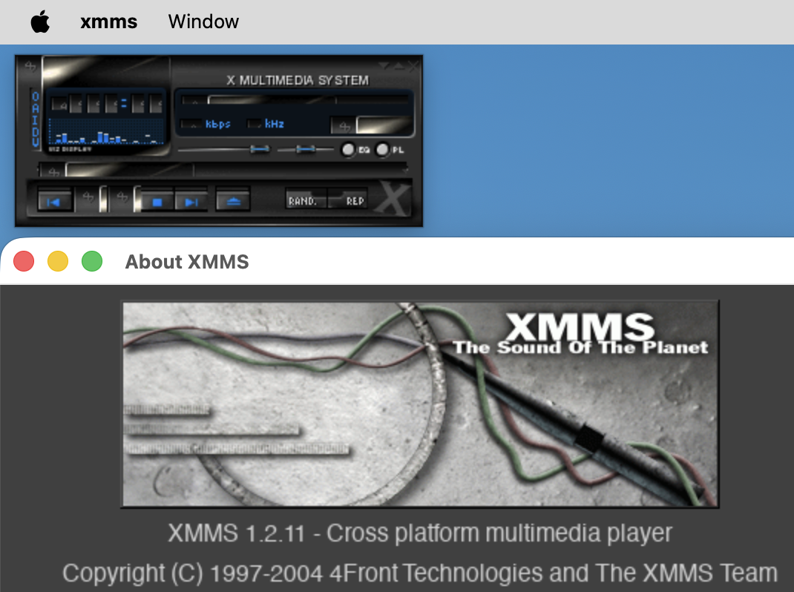</a>

  ```sh
  make xmms                              # build GTK1 + XMMS against libx11-compat
  build/xmms/source/xmms/xmms            # launch the player
  ```

- [XNEdit](https://github.com/unixwork/xnedit): the Motif NEdit fork that renders editor text through Xft/fontconfig builds against the bundled Motif, `libXt-compat`, and the SDL_ttf-backed `libXft-compat`.
  It validates Unicode text rendering in an interactive Motif editor, including Latin-1, Greek, and CJK glyph fallback through the Xft path.

  <a href="assets/xnedit.png">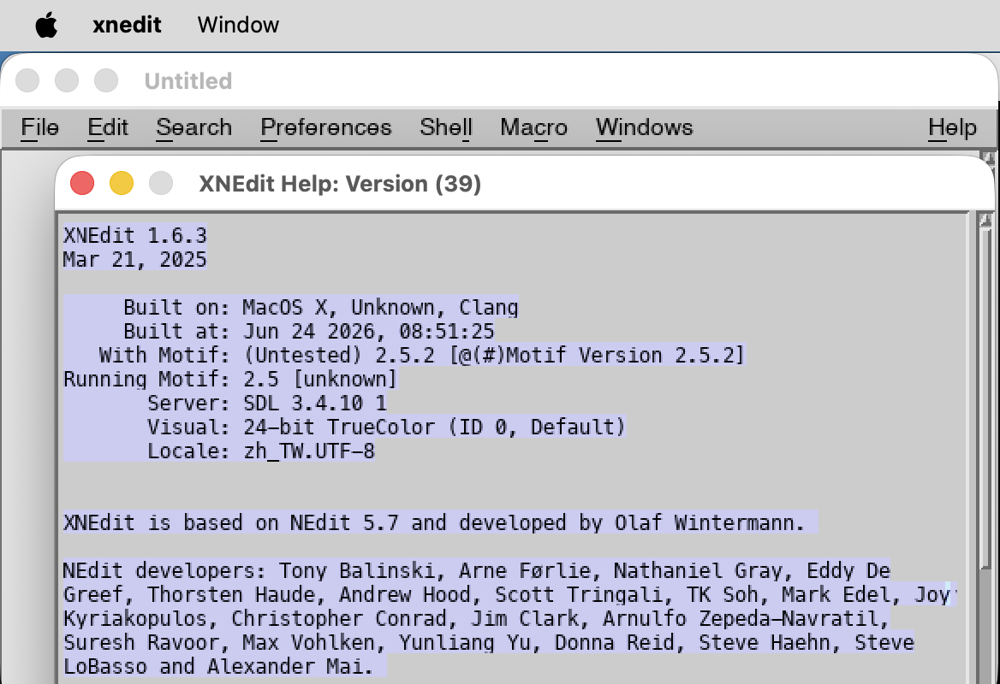</a>

  ```sh
  make xnedit                            # build XNEdit (depends on motif + Xft shim)
  build/xnedit/source/source/xnedit tests/ui/fixtures/xnedit-fixture.txt
  ```

- [XEphem](https://github.com/XEphem/XEphem): the Motif astronomy application builds against the bundled Motif plus `libXt-compat`, `libXext-compat`, `libXmu-compat`, and `libX11-compat`.
  It exercises a large Motif UI with Xlib drawing, image/catalog loading, and OpenSSL-backed network paths while keeping the upstream source unchanged.

  <a href="assets/xephem.png">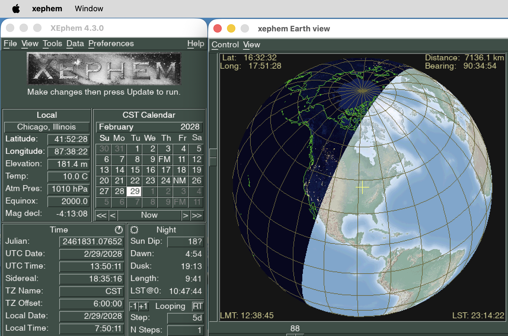</a>

  ```sh
  make xephem                            # build XEphem (depends on motif)
  build/xephem/source/GUI/xephem/xephem  # launch from the repo root
  ```

- [Grace](https://plasma-gate.weizmann.ac.il/Grace/): the Motif 2D plotting and data-analysis tool (`xmgrace`) builds against the bundled Motif plus `libXt-compat`, `libXmu-compat`, and `libX11-compat`.
  It exercises a large Motif UI over an Xlib drawing canvas: menus and cascade placement, the file-selection dialog (which round-trips filenames through compound strings), axis/tick/curve rendering, and PostScript hardcopy export.

  <a href="assets/grace.png">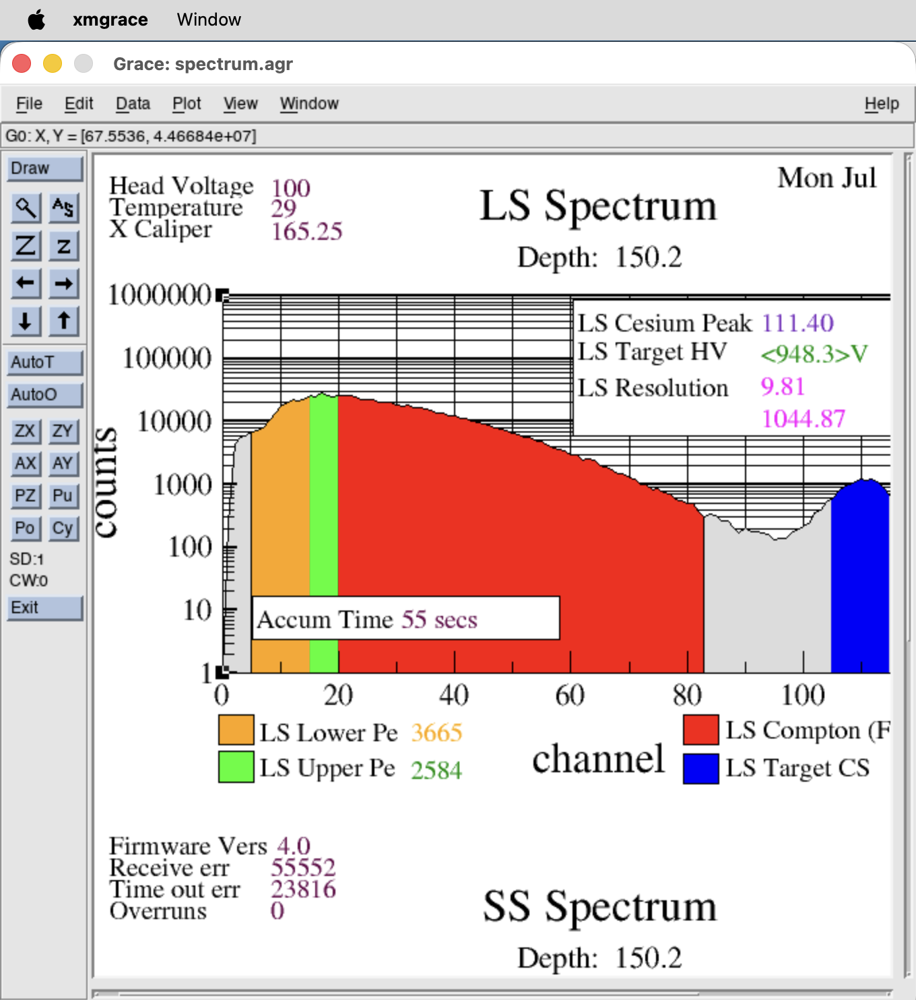</a>

  ```sh
  make grace                             # build Grace (depends on motif)
  build/grace/source/src/xmgrace         # launch the plotter
  ```

- [xwpe](https://github.com/vejeta/xwpe): the X Window Programming Environment builds against `libX11-compat` and the SDL_ttf-backed `libXft-compat`.
  This editor workload exercises Xrm option parsing, core window/event paths, XIM key lookup, selections, Xft/fontconfig fallback, and an older terminal-style UI rendered through Xlib.
  The capture below shows GPU-composited Xft glyphs and pixel-exact live resize on a HiDPI display, with syntax highlighting and clangd-driven inlay hints and semantic colours.

  <a href="assets/xwpe.png">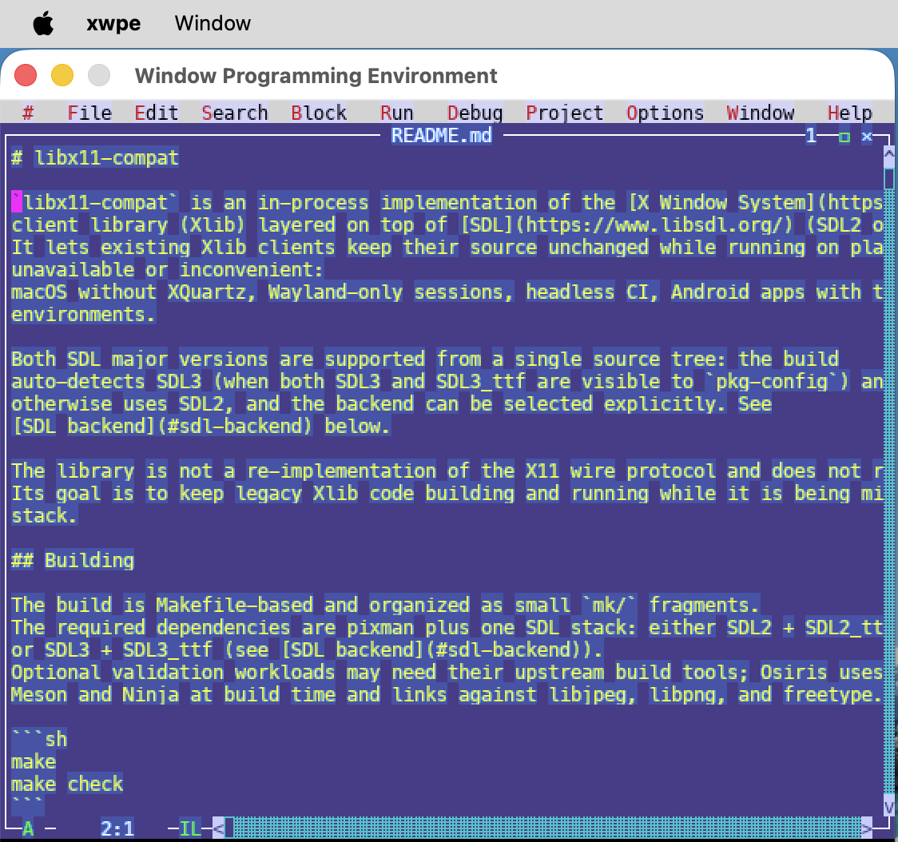</a>

  ```sh
  make xwpe                              # build xwpe (depends on Xft shim)
  build/xwpe/source/xwpe                 # launch from the build tree
  ```

- [Magic](http://opencircuitdesign.com/magic/): the [RTimothyEdwards/magic](https://github.com/RTimothyEdwards/magic) VLSI layout editor is the toolkit's first Tcl/Tk workload, with a private Tcl/Tk built alongside it (`mk/tcltk.mk`) so the port carries its own TkX11 rather than depending on a system Tk.
  It drives Magic's Tk UI over an Xlib-drawn layout canvas: the menu bar, layer palette, DRC toggle, and the `tut11d` tutorial cell, plus scrolling and resize redraw.
  With Magic's OpenGL graphics enabled it also opens Magic's 3D render window, so the 2D Tk editor and a live 3D view of the same cell render together with no X server.
  `MAGIC_OPENGL=auto` (the default) resolves per platform: on macOS it enables OpenGL once ANGLE is present, which a fresh checkout fetches and builds with `make fetch-angle build-angle` (the `build-angle` target requires the sources fetched first); on Linux it enables OpenGL when a `GL`/`GLU` header+link probe succeeds and drives Magic through the host's desktop GL/GLU. Opt out with `MAGIC_OPENGL=0`.
  On the macOS/ANGLE path the 3D view runs through the in-tree GLX-over-EGL / gl4es stack with no desktop-GL driver present; the Linux path instead relies on the host's desktop GL.
  See [GLX and OpenGL](#glx-and-opengl) for that path and its limits.

  <a href="assets/magic.png">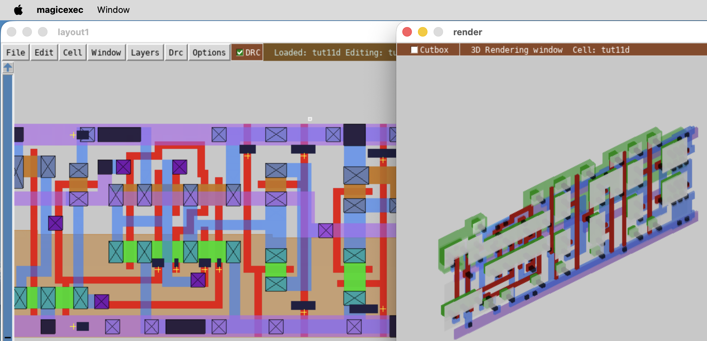</a>

  ```sh
  make magic                                   # build Magic + private Tcl/Tk
  CAD_ROOT=build/magic/install/lib build/magic/install/bin/magic -d OGL
  ```

The value of these ports is not that they replace a real X11, Motif, or Qt2 install today,
but that they keep legacy Xlib clients building and running on platforms where no X server is available while migration is in progress.

These ports rely on community input.
Concrete reproducers, screenshot diffs, and small fixes posted to [GitHub Issues](https://github.com/sysprog21/libx11-compat/issues) are the most effective way to push these workloads forward.
Specific gaps worth opening issues for include widget paths that misrender, Motif demos that crash or differ visibly from the native baseline, Osiris/Qt2 menu or Designer interactions that differ from native X11, ViolaWWW interactions (navigation, dialogs, image formats) that do not behave as the historical browser did, and Xfig drawings whose objects rasterize differently than under a real X server.

## Coverage and Compatibility

The exported public Xlib surface is listed in [`tests/api-symbols.txt`](tests/api-symbols.txt) and enforced by `make symbol-coverage`.
It covers window, drawable, GC, pixmap, image, event, input, atom, property, color, font, cursor, region, X Resource Manager, and selected Xt/Motif-adjacent compatibility paths for the cases that real Xlib clients exercise.
Selection, property, and resource-manager support is partial;
MIT-SHM is a thin wrapper over the regular image path;
Xcms and input methods are intentionally stubbed.
GLX is supported through an in-process translation onto EGL; see [GLX and OpenGL](#glx-and-opengl) below for the capability and its limits.

See [`docs/COVERAGE.md`](docs/COVERAGE.md) for the per-subsystem status table, surface notes (window manager hints, raster ops, mouse wheel mapping), and compatibility limits.

### GLX and OpenGL

GLX 1.3 is implemented in process as a thin translation onto EGL, resolved at runtime to a provider: ANGLE (GLES on Metal) on macOS, or surfaceless Mesa on Linux (also the macOS fallback). With no provider present every `glX*` entry point returns a safe null/false and `XQueryExtension` keeps reporting GLX absent, so a non-GLX client is unaffected. `GLX=0` compiles the layer out entirely.

Desktop GL 1.x/2.x is translated to GLES2 by the bundled [gl4es](https://github.com/ptitSeb/gl4es); its public `gl*` are baked into a static archive (`libgl4es.a`) that a client links directly, so a demo binary needs no dynamic desktop-GL library. Rendering works headless (an offscreen pbuffer is composited back to the window; `SDL_VIDEODRIVER=dummy` drives CI) and on screen through an ANGLE `CAMetalLayer` on macOS. It is exercised by the unmodified Mesa `xdemos` (glxgears, glxdemo, glxheads, sharedtex, multictx, glxswapcontrol) and the Motif `paperplane` GLw demo shown above.

Limitations:
- Not the GLX wire protocol; there is no indirect or networked GLX. It is in-process only.
- No GLVND dispatch. A desktop-GL client that resolves `gl*` through the system GLVND / `libGL` dispatcher (for example `glxinfo`, or anything that `dlopen`s `libGL`) does not route into the translation: those `gl*` calls never reach the EGL context. A client renders only if its `gl*` bind to the linked gl4es archive, directly or through `glXGetProcAddress`. So this drives GLX clients whose OpenGL goes through gl4es, not arbitrary desktop-GL binaries.
- GLES feature ceiling. Only what gl4es maps onto GLES2/3, and what the provider exposes, is available; desktop-GL features beyond that are not.
- Shared and multi-context rendering works (each `GLXContext` gets its own gl4es state), but some gl4es cross-context caches (shader programs, FBOs, queries) are only partially separated, so unusual object-sharing patterns can still misrender.
- macOS specifics: ANGLE is opt-in (`make build-angle`), and the GL window is pinned to a 1:1 point-to-pixel drawable, so it fills the window at logical (non-native Retina) resolution.

Treat GLX here as a migration bridge for GLX+Motif/GLw and other gl4es-linkable clients, not a general-purpose OpenGL runtime.

## Porting an Existing Xlib Client

Most Xlib sources need no edits (porting is a build-system and runtime-environment exercise).
The general shape:

1. Link the application against `build/libX11-compat.so` plus the SDL stack it was built with (SDL2 + SDL2_ttf, or SDL3 + SDL3_ttf) and pixman, replacing the system `-lX11`.
2. Keep the existing Xlib source unchanged.
3. Drive the event loop with `XPending` / `XNextEvent` and `ConnectionNumber` + `select()`;
   the library pumps SDL internally.
4. Use `WM_DELETE_WINDOW` via `XSetWMProtocols` so the SDL close button produces a clean shutdown.
5. Run with `SDL_VIDEODRIVER=dummy` for headless CI.

See [`docs/PORTING.md`](docs/PORTING.md) for the full guide,
including code snippets keyed to the bundled examples and a checklist of cases where the library is a stepping stone rather than a destination (GLX, real XIM, ICC color management, cross-process selection).

## Contributing

Reports of incorrect Xlib semantics, missing entry points that block real applications, and patches that tighten coverage against the manifest in [`tests/api-symbols.txt`](tests/api-symbols.txt) are particularly useful.

## License

`libX11-compat` is available under a permissive [MIT](https://opensource.org/license/mit)-style license.
Use of this source code is governed by an MIT license that can be found in the [LICENSE](LICENSE) file.
